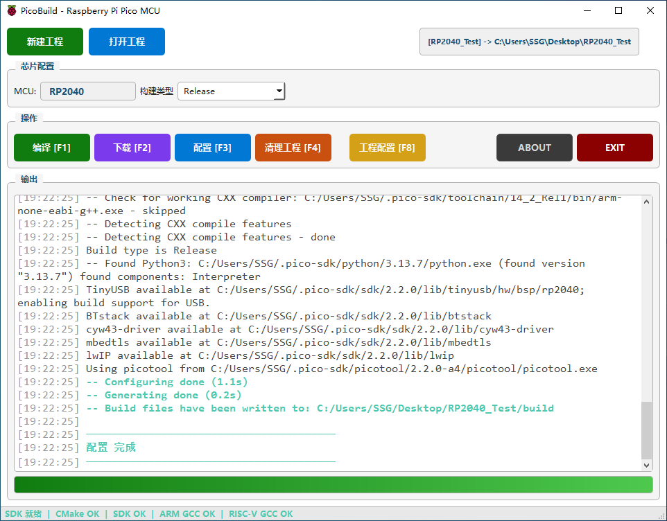
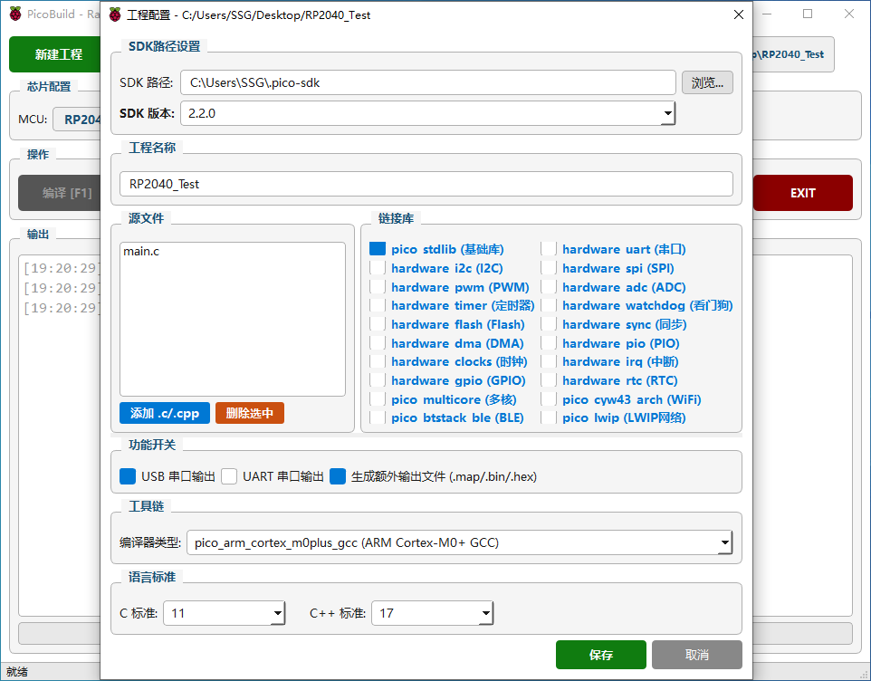

  

  

  

  

 
# RP Pico All-in-One Development Tool

I am a big fan of Raspberry Pi Pico and Pico 2. These microcontrollers are incredibly capable.
However, I ran into numerous difficulties while working with the official development environment, which made MCU development a frustrating experience.
For this reason, I have built a GUI application that runs on Windows. It delivers simpler, more intuitive visual operations for environment configuration, project compilation, firmware flashing and more.
This tool is created for fellow Raspberry Pi embedded enthusiasts to make working with the RP2040 and RP2350 much easier.
It is non-commercial.
This tool inevitably has several shortcomings at present. If the official Raspberry Pi team comes across this project, I would greatly appreciate any valuable feedback and suggestions you may provide.

RP Pico All-in-One Development Tool
A Qt-based graphical desktop tool exclusively designed for Windows 64-bit systems, dedicated to Raspberry Pi Pico series (RP2040 / RP2350) development. It supports independent project creation and management, local offline compilation, one-click firmware flashing, and serial port debugging with full visual operation and zero command-line input required. Seamlessly integrated with VSCode and fully compatible with the official Raspberry Pi Pico SDK ecosystem, it greatly lowers the embedded development threshold and improves development efficiency for both beginners and experienced developers.

***

The SDK and precompiled executable program are available for download via the Releases link on the repository homepage.

After downloading, extract the files to your local PC. Please note the SDK folder name must be .pico-sdk.

The executable in the Releases version defaults to Chinese language. You may switch to English from the top-left menu.

Your language selection will be saved in the INI configuration file and loaded automatically on the next launch.

sha256:a5fb39b14755e27b3e0a886188e34855facad13a249cba91f0d0768e8fef5701
***

✨ Core Features
- Independent Project Management – Create brand-new Pico projects or open existing local projects freely for full project management
- Local Offline Compilation – Compile Pico C/C++ projects locally with pure graphical operations, no command-line operations needed
- One-Click Firmware Flashing – Rapidly compile, download and flash UF2 firmware for RP2040 and RP2350 chips
- Seamless VSCode Integration – Projects created by this tool come with built-in JSON configuration files. Simply open the project folder in VSCode to load configurations automatically, enabling instant code hints and auto-completion
- Native Official SDK Compatibility – Fully compliant with the official Raspberry Pi VSCode SDK system. Only a .pico-sdk folder is required, which integrates complete development components including SDK, CMake, Picotool and more
- Multi-SDK Version Support – Natively supports official stable SDK versions: 2.2.0 and 2.3.0, covering mainstream Pico development versions
- Smart SDK Path Configuration – Automatically scans for the local .pico-sdk directory. Manual path selection is supported if auto-scan fails, with one-click environment initialization
- Dedicated System Optimization – Deeply optimized and fully compatible with Windows 64-bit operating system for stable operation

🎯 Supported Chips & Boards
- Raspberry Pi Pico (RP2040)
- Raspberry Pi Pico W / Pico WH
- Raspberry Pi Pico 2 (RP2350)
- All third-party compatible RP2040 / RP2350 boards

🛠 Build & Environment Instructions
This Qt-based application only supports Windows 64-bit systems. You can compile and build the project via Qt Creator. The tool depends on the official Pico SDK environment:
1. Download the official .pico-sdk folder (contains complete SDK, CMake, Picotool and other essential development tools)
2. The tool will automatically scan for the local .pico-sdk path; manually specify the directory if auto-detection fails
3. Select your installed SDK version (2.2.0 / 2.3.0) and click the configure button to initialize the development environment
4. Source code compilation: Install Qt 5.15+ or Qt 6, clone the repository and open the .pro project file in Qt Creator
5. Configure the build kit and compile the project to launch the application

📦 User Guide
1. Environment Setup: Prepare the official .pico-sdk folder (2.2.0 / 2.3.0). Let the tool auto-scan the path or add it manually, then click configure to activate the environment
2. Project Creation & Opening: Create new blank Pico projects or open existing local project folders directly
3. Code Development: Open the tool-generated project folder with VSCode. The built-in JSON files will be loaded automatically to enable full code hints and syntax auto-completion
4. Local Compilation: Compile the project offline with one click inside the tool to generate standard UF2 firmware
5. Firmware Flashing & Debugging: Connect your Pico board via USB, flash the compiled firmware, and start real-time serial port debugging

💡 Advantages
Traditional Raspberry Pi Pico development requires complicated command-line operations and tedious manual VSCode plugin configuration, creating a high learning barrier for beginners. This tool provides a full-graphical, zero-CLI Windows development solution, covering project management, environment configuration, local compilation and firmware flashing. It reuses the official standard Pico SDK system, balancing official development specifications and user-friendly visual operations, greatly improving development efficiency for all users.
📄 License
This project is open-sourced under the MIT License. You are free to use, modify, and distribute the code, and welcome to submit contributions.

⚠️ Disclaimer
This development tool is for hobbyist and educational use only.
It is NOT certified for safety-critical industrial, medical or aerospace equipment.
Users take full responsibility for all hardware and software projects developed with this tool.

🤝 Contribution
Pull requests, issues, and feature suggestions are highly welcome!
you can contact me via email:
[ssgmetal@163.com](mailto:ssgmetal@163.com)
Let’s build a better RP2040/RP2350 open-source development ecosystem together.
=============================================================================================================================================================================================================================================================================
RP Pico 一站式开发工具
这是一款基于 Qt 开发、专为树莓派 Pico 系列（RP2040 / RP2350）打造的Windows 64位专属本地图形化一站式开发工具。软件支持独立创建、打开、管理Pico工程，集成本地离线编译、固件一键烧录、串口调试等全流程功能，全程无命令行操作。同时完美联动VSCode编辑器，搭配官方Pico开发SDK生态，大幅简化嵌入式开发门槛，适配新手入门与开发者高效开发。

✨ 核心功能
- 独立工程管理 – 支持全新创建Pico工程、一键打开本地已有工程，自主管理所有开发项目
- 本地离线编译 – 本地完成Pico C/C++项目编译，全程可视化操作，无需输入任何命令行
- 一键固件烧录 – 为 RP2040、RP2350 芯片快速编译、下载并烧录UF2固件
- VSCode 无缝联动 – 软件创建的工程可直接用VSCode打开，工程自带专属JSON配置文件，打开文件夹即可自动载入配置，实现全自动代码提示、语法补全、工程识别
- 原生适配官方SDK生态 – 完全兼容树莓派官方VSCode插件SDK文件体系，仅需配置.pico-sdk文件夹，内置CMAKE、PICOtool、完整SDK内核等全套开发组件
- 多版本SDK适配 – 原生支持官方稳定版 SDK 2.2.0、2.3.0，覆盖主流Pico开发版本
- 智能SDK路径配置 – 支持全自动扫描本地.pico-sdk文件夹路径，扫描失败可手动添加路径，一键完成环境配置激活
- 串口调试控制台 – 实时日志查看、串口监控与设备信息解析，便捷调试设备程序
- 固件批量管理 – 支持多款UF2固件的预览、分类管理与批量烧录
- 专属系统适配 – 深度适配 Windows 64位 操作系统，运行稳定、兼容性强
- 
🎯 支持芯片与开发板
- 树莓派 Pico（RP2040）
- 树莓派 Pico W / Pico WH
- 树莓派 Pico 2（RP2350）
- 所有兼容 RP2040 / RP2350 的第三方开发板
- 
🛠 开发环境与编译说明
本工具基于Qt开发，仅适配Windows 64位系统，可通过Qt Creator编译构建，工具运行依赖官方Pico SDK基础环境：
1. 提前下载官方 .pico-sdk 文件夹（内置SDK、CMAKE、PICOtool等全套开发工具）
2. 工具启动后自动扫描本地SDK路径，识别失败可手动选择.pico-sdk文件夹目录
3. 选择对应SDK版本（2.2.0 / 2.3.0），点击配置按钮即可完成环境初始化
4. 源码编译：安装 Qt 5.15 及以上版本或 Qt 6，克隆仓库后用Qt Creator打开.pro工程文件
5. 配置编译套件，构建项目后即可运行完整功能程序
6. 
📦 完整使用教程
1. 环境配置：准备官方.pico-sdk文件夹（支持2.2.0、2.3.0版本），打开软件等待自动扫描路径，或手动添加路径后点击【配置】完成环境激活
2. 工程创建/打开：支持独立新建空白Pico工程，或直接打开本地已有的Pico工程文件夹
3. 代码开发：将软件创建的工程文件夹用VSCode直接打开，自带JSON配置文件自动载入，无需额外配置，自动触发代码提示与语法补全
4. 本地编译：完成代码编写后，在软件内一键执行本地离线编译，生成标准UF2固件
5. 固件烧录调试：USB连接Pico开发板，一键烧录编译好的固件，开启串口实时调试
6. 
💡 工具优势
传统树莓派Pico开发依赖繁琐的命令行操作或VSCode插件单独配置，环境搭建复杂、新手上手难度高。本工具基于Windows 64位系统深度适配，实现全界面化零命令行操作，自主完成工程管理、环境配置、本地编译、固件烧录。同时完美联动VSCode编辑器，复用官方原生SDK体系，兼顾官方开发规范性与可视化操作的便捷性，既降低新手入门门槛，也能大幅提升资深开发者的项目开发效率。
📄 开源协议
本项目基于 MIT 开源协议 开源，你可自由使用、修改、分发项目代码，也可参与项目贡献。
🤝 参与贡献

欢迎提交 Issue、Pull Request，也可踊跃提出功能建议！让我们共同完善 RP2040/RP2350 开源开发生态。
